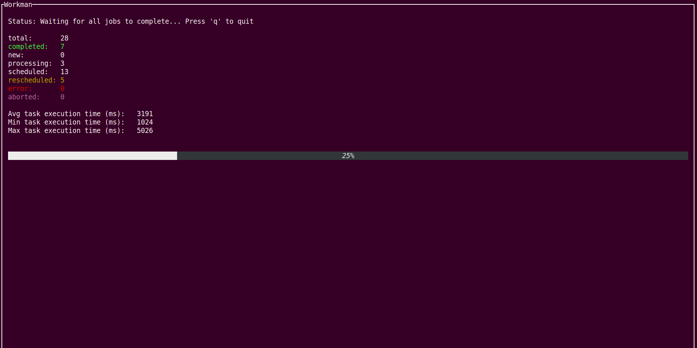

# Workman

Workman is a command line utility to process commands using pool of workers

Workman maintains local SQLite database and:

* Track task statuses
* Handle failures and retries
* Save command stout and stderr
* Show simple terminal user interface
* Show min, max and avg command execution time

To undertand what workman is doing, here is simle usage example:

### Create tasks.txt file, which contains tasks (each task in new line)

```
1
2
3
// and so on
```

Task can be any string, not just numbers

### Create simple job script

We will create job.php file with this content:

```
<?php

sleep(rand(1, 5));

echo $argv[1];

exit(rand(0, 1));
```

### Execute workman

```
workman --tasks ./tasks.txt --workers 4 --database progress.db --tries 3 --retry-delay 10 --exec 'php job.php {{task}}'
```

Workman will import tasks from tasks.txt file into progress.db, create 4 worker threads and begin executing out job

{{tasks}} will be replaced by whatever your task is in tasks.txt file

If command exit code is not 0, it will retry command after 10 seconds. After 3 failures job will fail

Here is what you will see




You can open progress.db file with any SQLite client to show additional information (stdout, stderr etc) and you can even edit it manually